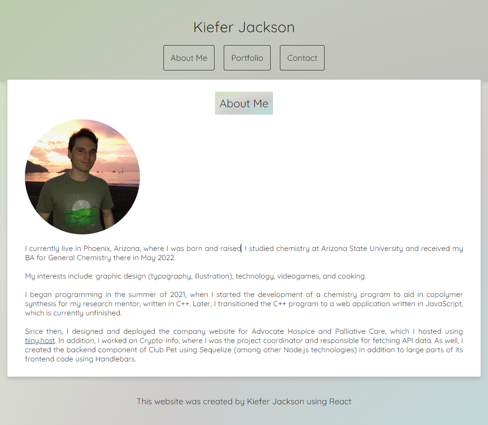

# React Portfolio

[Link to the deployed application](https://kieferjackson.github.io/react-portfolio/)

Here is a screenshot of the deployed portfolio:
    

## Description
Self-made portfolio created with the React framework. Features the following page sections:
- About Me: Includes an image of myself in addition to personal information.
- Portfolio: Provides links to relevant projects with links to the deployed application, technologies used, and a link to its GitHub repository.
- Contact: Offers contact information (GitHub, phone number, and email address)

## Table of Contents
- [Installation](#installation)
- [Usage](#usage)
- [Credits](#credits)

## Installation
N/A

## Usage
Viewing about, contact, and portfolio information related to Kiefer Jackson.

## Contributing
N/A

## Tests
N/A

## Questions
If you have any questions related to this project, contact through my [GitHub](https://github.com/kieferjackson) or contact at the following email address: [kieferleejackson@gmail.com](kieferleejackson@gmail.com)

## Credits
This project was developed by [kieferjackson](https://github.com/kieferjackson)
